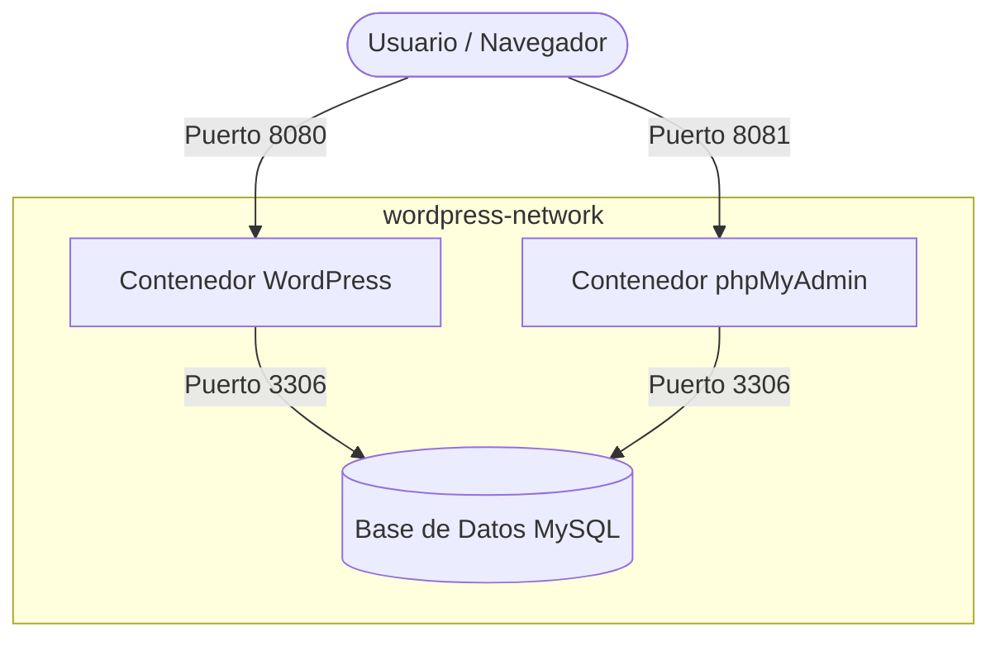

# Despliegue de WordPress con Docker Compose

Este repositorio contiene la arquitectura y configuración para desplegar un entorno contenedorizado de WordPress junto con una base de datos MySQL usando Docker Compose.

## Requisitos
* Docker
* Docker Compose

## Estructura de Servicios
* **WordPress:** Servicio principal expuesto en el puerto host `8080` (Contenedor `wordpress_app`).
* **MySQL 8.0:** Base de datos relacional (Contenedor `wordpress_db`).
* **Volúmenes:** Almacenamiento persistente para la base de datos y los archivos de WordPress.

* ## Arquitectura de la Solución

## Instrucciones de Despliegue

1. Clonar el repositorio:

2. bash
git clone
